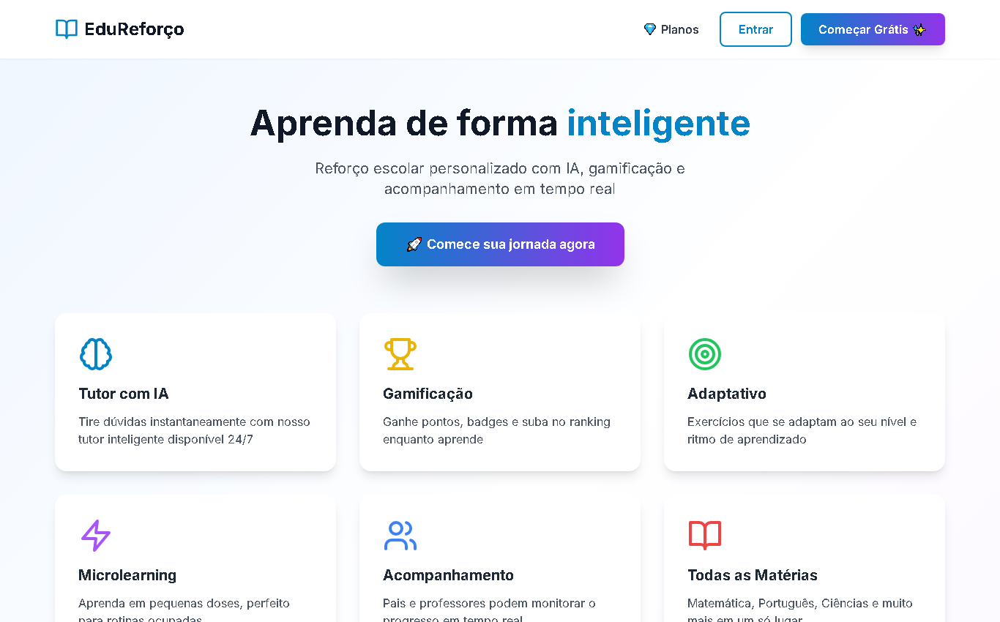
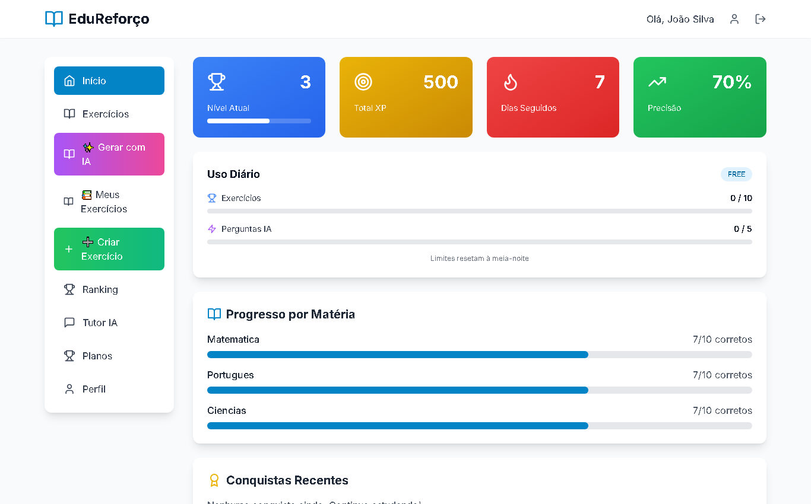
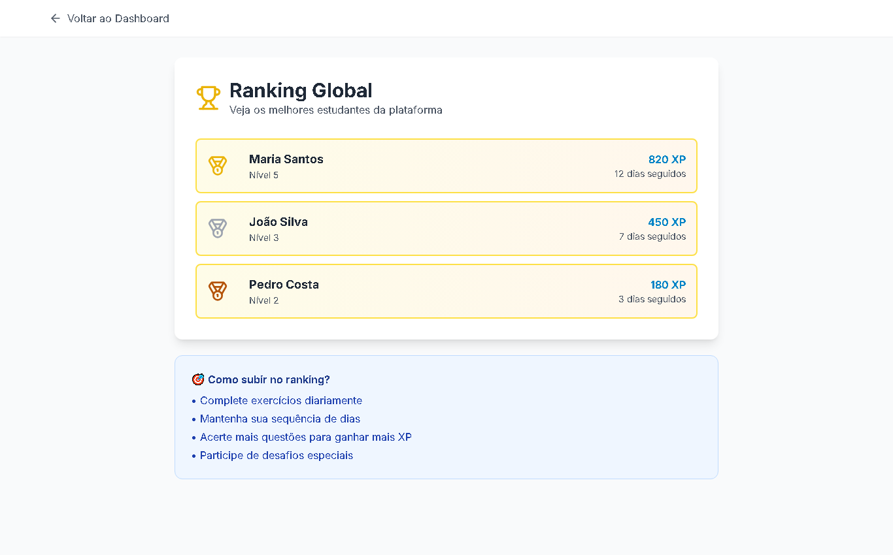
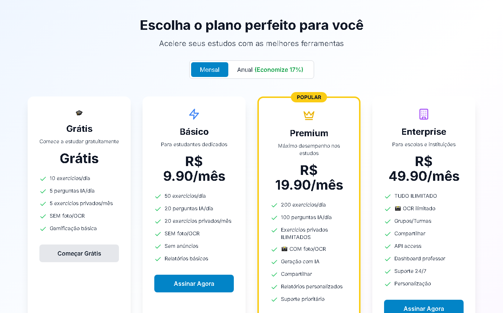
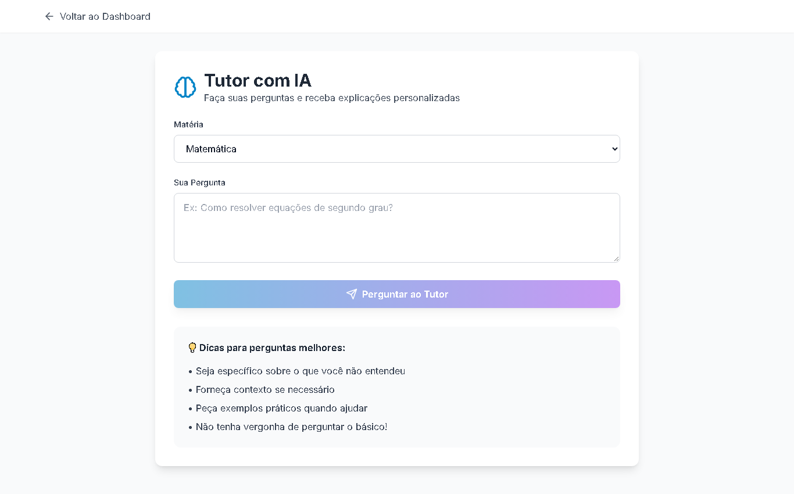
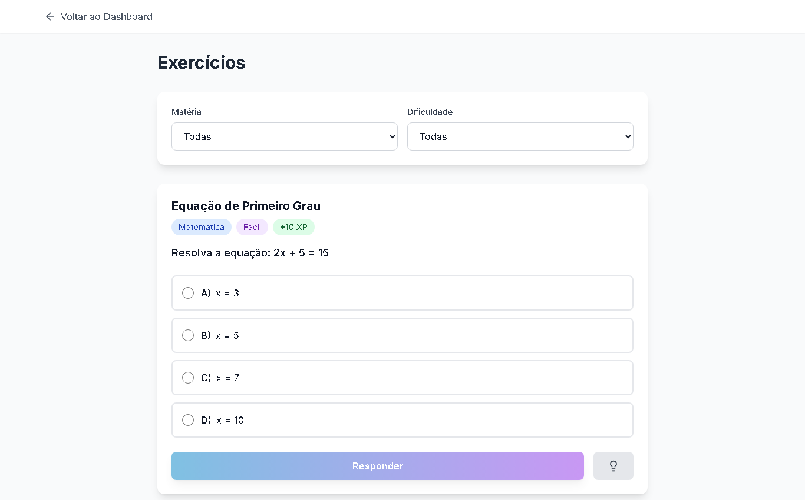

<div align="center">

# 📚 EduReforço

### Plataforma Educacional Gamificada com IA


[Demo](#) • [Documentação](#instalação) • [Contato](#contato)

</div>

---

## 🎯 Sobre o Projeto

**EduReforço** é uma plataforma completa de reforço escolar que combina **inteligência artificial**, **gamificação** e **OCR** para criar uma experiência de aprendizado personalizada e engajadora.

O projeto resolve três problemas principais:
- 📚 **Falta de personalização** no ensino
- 🎮 **Baixo engajamento** dos alunos
- 💰 **Alto custo** de reforço escolar particular

### 🌟 Principais Diferenciais

- 🤖 **IA Gratuita** - Utiliza Groq API (LLaMA 3.3) para tutoria sem custos
- 📸 **OCR Integrado** - Digitalize exercícios tirando foto
- 🎮 **Gamificação Completa** - Sistema de XP, níveis, badges e ranking
- 💎 **Monetização Implementada** - 4 planos de assinatura prontos
- 📱 **Mobile-First** - Design responsivo e PWA-ready

---

## 📸 Demonstração da Plataforma

<div align="center">

### 🏠 Página Inicial & Dashboard do Aluno
<p align="center">
  
  
</p>

### 🏆 Gamificação & 💎 Planos de Assinatura
<p align="center">
  
  
</p>

### 🤖 Tutor com IA & 📝 Exercícios
<p align="center">
  
  
</p>

</div>

---

## ✨ Funcionalidades


### Para Alunos
- 🧠 **Tutor IA Personalizado** - Tire dúvidas e receba explicações
- 📝 **Exercícios Adaptativos** - Conteúdo ajustado à série escolar
- 🎯 **Sessões de Estudo IA** - Geração automática de exercícios
- 📊 **Dashboard de Progresso** - Acompanhe seu desempenho
- 🏆 **Sistema de Conquistas** - Ganhe XP, suba de nível e desbloqueie badges

### Para Criadores de Conteúdo
- 📸 **Upload via OCR** - Tire foto de exercícios e converta em digital
- ✏️ **Criação Manual** - Interface intuitiva para criar exercícios
- 🔒 **Exercícios Privados** - Crie conteúdo para uso pessoal

### Para Administradores
- 👥 **Gestão de Usuários** - Sistema de roles (aluno, professor, admin)
- ⚖️ **Moderação de Conteúdo** - Aprovação de exercícios públicos
- 📈 **Analytics** - Acompanhamento de uso e engajamento

---

## 🛠️ Stack Tecnológica

### Frontend
```
Next.js 14  •  TypeScript  •  TailwindCSS  •  Zustand  •  Axios
```

### Backend
```
FastAPI  •  SQLAlchemy  •  SQLite/PostgreSQL  •  JWT  •  Pydantic
```

### Integrações IA
```
Groq API (LLaMA 3.3)  •  Tesseract OCR  •  Pillow
```

---

## 💎 Planos de Assinatura

| Funcionalidade | Free | Basic | Premium | Enterprise |
|----------------|:----:|:-----:|:-------:|:----------:|
| Exercícios IA/dia | 5 | 20 | 100 | ♾️ |
| Perguntas IA/dia | 10 | 50 | ♾️ | ♾️ |
| Exercícios privados/mês | 5 | 20 | 100 | ♾️ |
| OCR (digitalização) | ❌ | ✅ | ✅ | ✅ |
| Compartilhamento | ❌ | ❌ | ✅ | ✅ |

---

## 🚀 Instalação

### Pré-requisitos
- **Python 3.11+**
- **Node.js 18+**
- **Tesseract OCR** ([Download](https://github.com/UB-Mannheim/tesseract/wiki))

### 1️⃣ Backend

```bash
cd backend

# Criar ambiente virtual
python -m venv venv
venv\Scripts\activate  # Windows | source venv/bin/activate (Linux/Mac)

# Instalar dependências
pip install -r requirements.txt

# Configurar variáveis de ambiente
copy .env.example .env
# Edite o .env com suas chaves (GROQ_API_KEY, SECRET_KEY)

# Inicializar banco de dados
python scripts/seed_data.py
python scripts/seed_plans.py

# Iniciar servidor
python -m uvicorn app.main:app --reload --host 0.0.0.0 --port 8000
```

### 2️⃣ Frontend

```bash
cd frontend

# Instalar dependências
npm install

# Configurar variáveis de ambiente
copy .env.example .env.local
# Edite com: NEXT_PUBLIC_API_URL=http://localhost:8000

# Iniciar aplicação
npm run dev
```

### 3️⃣ Configurar IA (Groq)

1. Crie uma conta gratuita em [console.groq.com](https://console.groq.com)
2. Gere uma API key
3. Adicione ao `backend/.env`:
   ```
   GROQ_API_KEY=sua-chave-aqui
   ```

---

## 📱 Testar no Celular

1. Descubra seu IP local: `ipconfig` (Windows) ou `ifconfig` (Linux/Mac)
2. Configure `NEXT_PUBLIC_API_URL=http://SEU-IP:8000` no frontend
3. Acesse `http://SEU-IP:3000` no celular (mesma rede Wi-Fi)

---

## 📂 Estrutura do Projeto

```
edureforco-app/
├── backend/
│   ├── app/
│   │   ├── api/v1/          # Endpoints REST
│   │   ├── models/          # Modelos SQLAlchemy
│   │   ├── schemas/         # Validação Pydantic
│   │   ├── services/        # Lógica de negócio (IA, OCR)
│   │   ├── core/            # Config e segurança
│   │   └── middleware/      # Limites e autenticação
│   └── scripts/             # Seeds e utilitários
│
├── frontend/
│   └── src/
│       ├── app/             # Páginas Next.js 14
│       ├── components/      # Componentes React
│       ├── lib/             # API client e utils
│       └── store/           # Estado global (Zustand)
│
└── README.md
```

---

## 🌐 Deploy

### Frontend (Vercel)
1. Conecte seu repositório GitHub
2. Configure `NEXT_PUBLIC_API_URL` nas variáveis de ambiente
3. Deploy automático a cada push

### Backend (Render/Railway)
1. Configure variáveis de ambiente (`GROQ_API_KEY`, `SECRET_KEY`, `DATABASE_URL`)
2. Migre de SQLite para PostgreSQL
3. Configure CORS para seu domínio

---

## 🧪 Recursos Técnicos Implementados

- ✅ Autenticação JWT com refresh tokens
- ✅ Sistema de roles e permissões
- ✅ Middleware de rate limiting por plano
- ✅ Upload e processamento de imagens (OCR)
- ✅ Integração com IA (geração de exercícios e tutoria)
- ✅ Sistema de gamificação (XP, níveis, badges)
- ✅ Dashboard com métricas em tempo real
- ✅ Arquitetura REST escalável
- ✅ Validação de dados com Pydantic
- ✅ ORM com SQLAlchemy (suporta SQLite e PostgreSQL)

---

## 📈 Próximos Passos

- [ ] Integração com gateway de pagamento (Stripe)
- [ ] App mobile nativo (React Native)
- [ ] Sistema de notificações push
- [ ] Analytics avançado com gráficos
- [ ] Modo offline (PWA)
- [ ] Multiplayer (competições entre alunos)

---

## 📄 Licença

Este projeto foi desenvolvido para fins educacionais e de portfólio.

---

## 📧 Contato

**Desenvolvido por Jessica Chaves**

[](https://github.com/Jessicachaves)
[](https://linkedin.com/in/seu-perfil)

---

<div align="center">

⭐ **Se este projeto foi útil, considere dar uma estrela!** ⭐

</div>
